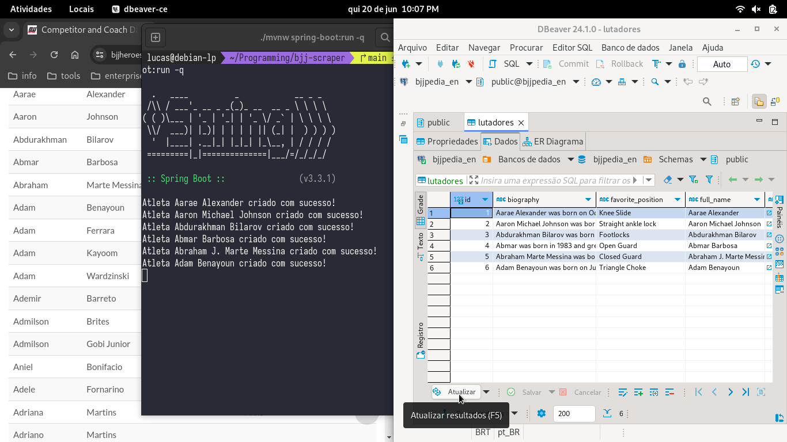

<h1 align="center">Tha BJJ Scraper 🥋</h1>

<h4 align="center">
<em>Jiu-Jitsu athletes' data from all over the world</em>
<br>
<em>at the reach of your database. 🎣 🗃️</em>
</h4>

### [README em Português 🇧🇷](README.md)

#### Click on the image below to watch the demo:

[](https://youtu.be/UQqTsonjP0c)


✅ Requirements:
-------------------

- JDK 21
- PostgreSQL

> 💡 *The project can be plugged into other databases like MySQL or MariaDB, but its default configuration comes with
> PostgreSQL.*

⚙️ Configuration:
-------------------

Open the terminal and clone the scraper to your machine:

    git clone https://github.com/lucaspicinini/bjj-scraper.git

If you do not have git installed, you can download and unzip the scraper by clicking on **Download ZIP** on the image below:

[](https://github.com/lucaspicinini/bjj-scraper/archive/refs/heads/main.zip)

Configure the JDBC URL, username, and password of your database in the file:

    /bjj-scrap/src/main/resources/application.properties

> 💡 *It is **highly recommended** that you use the environment variables already defined in the file. Just create environment variables
> with the same names in your runtime environment and assign the correct values to access your database.*
>
> *Example:*
> - *DB_HOST=localhost*
> - *DB_USER=root*
> - *DB_PASSWORD=123456*
> - *DB_NAME=your_database*
>
> ***It is not** recommended that you use access values directly in the `application.properties` file, unless*
> *the scraper is hosted on your localhost.*

Now, return to the project's root directory...

      /bjj-scraper

and install the dependencies using this Maven Wrapper command, which is already included in the project. For Linux and Mac:

      ./mvnw clean compile

On Windows:

      mvnw.cmd clean compile

Run the project with this command on Linux and Mac:

      ./mvnw spring-boot:run -q

and on Windows:

      mvnw.cmd spring-boot:run -q

#### Done! The scraping bot is now saving BJJ Heroes data to your database in real time.

🤖 Enabling AI Translation in Scraping:
-------------------

This scraper already has the [AI Mistral](https://chat.mistral.ai/chat) API implemented and ready for use, but it is disabled by default. To enable
AI translation in your bot, follow the instructions below:

1) Go to the [Mistral AI API](https://console.mistral.ai/) website and register to obtain an API access key.

> 💡 **You can use a free trial period for testing without entering credit card information.**

**This was a requirement for choosing Mistral** for the scraper because the free trial is sufficient to translate the volume of data present in the online athlete repository with very satisfactory performance.

2) Access the `AiApiConfigs` class at:

> `/bjj-scraper/src/main/java/io/github/lucaspicinini/bjj_scraper/utils/AiApiConfigs`

3) Create an environment variable for `MISTRAL_AI_KEY` containing the value of your key:

> Example:
> - MISTRAL_AI_KEY=ja7s9a8s7djhn1LKuaygJUAy

4) If the scraper is not running in a production environment, you can insert your key directly into the class, leaving it like this:

```java
package io.github.lucaspicinini.bjj_scraper.utils;

public class AiApiConfigs {
    public static final boolean USE_AI_API = false;
    public static final String MISTRAL_AI_KEY = "YOUR ACCESS KEY HERE";
}
```

5) Still in the AiApiConfigs class, change the value of USE_AI_API from false to true, leaving the class like this:

```java
package io.github.lucaspicinini.bjj_scraper.utils;

public class AiApiConfigs {
    public static final boolean USE_AI_API = true;
    public static final String MISTRAL_AI_KEY = "YOUR ACCESS KEY HERE";
}
```

#### Done! The scraping bot is now saving all athlete data in Portuguese.

> You can change the translation language of the AI by modifying the prompt sent to Mistral in the model.generate() method in AiApiChat class. Example: **model.generate("Translate to Spanish and return only the translation: " + text)**;

```java
public static String getResponse(String text) {
    ChatLanguageModel model = MistralAiChatModel.builder()
            .modelName(MistralAiChatModelName.MISTRAL_SMALL_LATEST)
            .apiKey(AiApiConfigs.MISTRAL_AI_KEY)
            .build();
    
    String response = model.generate("Traduza para pt-br e me retorne só a tradução: " + text);
    return response;
}
```

🤖 Interacting with AI in a Custom Way:
-------------------

You can use Artificial Intelligence however you like and customize the interaction of data with the Generative AI. There is a ready method for this!
In the file `/bjj-scraper/src/main/java/io/github/lucaspicinini/bjj_scraper/controller/AllFightersRequest` :

```java
public class AllFightersRequest {

    public static void getAllFighters(Repository repository) {
        .
        .
        .

        if (AiApiConfigs.USE_AI_API) {
            FighterTranslator.translateWithAi(fighter);

            // String text = "text you want to send to AI";
            // String response = AiApiChat.getGenericChat(text);
        }

        .
        .
        .
    }
}
```

Just uncomment the lines above, send a text to the `AiApiChat.getGenericChat()` method, and get the response from the method's return. Each iteration in the request loop to all fighters in the repository will go through this request once, but you can use the static method `AiApiChat.getGenericChat()` anywhere else in the project.

> 💡 You can comment out the FighterTranslator.translateWithAi(fighter) method if you want to use AI but do not want the translation feature.
 
### 💁🏽‍♂️ Contribution Guide

Thank you for making **bjj-scraper** better.

- Fork the repository to your account.
- Create a new branch to make changes (it's easier to manage modifications).
- Make your changes in this new branch.
- Create a Pull Request from this new branch to the main branch of this repository.

If you have any questions about anything else or about a Pull Request, open an [issue](https://github.com/lucaspicinini/bjj-scraper/issues) for discussion.

<hr>

#### License

- Check the [LICENSE](https://github.com/lucaspicinini/bjj-scraper/blob/main/LICENSE) file

#### Versions

* Version 1.0 ~ 20/06/2024