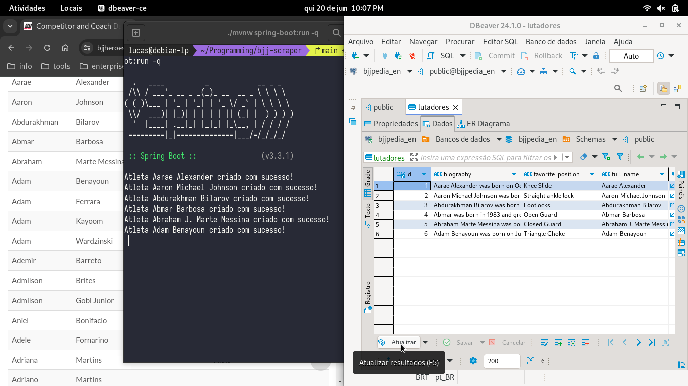

<h1 align="center">Tha BJJ Scraper 🥋</h1>

<h4 align="center">
<em>Dados de atletas de Jiu-Jitsu de todo planeta</em>
<br>
<em>ao alcance do seu banco de dados. 🎣 🗃️</em>
</h4>

#### Clique na imagem abaixo para assistir a demo:

[](https://youtu.be/UQqTsonjP0c)


✅ Requisitos:
-------------------

- JDK 21
- PostgreSQL

> 💡 *O projeto pode ser plugado em outros bancos de dados, como MySQL ou MariaDB, mas sua configuração default vem com
> a utilização do PostgreSQL.*

⚙️ Configuração:
-------------------

Abra o terminal e clone o scraper para sua máquina:

    git clone https://github.com/lucaspicinini/bjj-scraper.git

Caso não tenha o git instalado, você pode baixar e descompactar o scraper clicando em **Download ZIP** na imagem abaixo:

[](https://github.com/lucaspicinini/bjj-scraper/archive/refs/heads/main.zip)

Configure a url JDBC, o usuário e a senha do seu banco de dados no arquivo:

    /bjj-scrap/src/main/resources/application.properties

> 💡 *É **altamente recomendável** que você utilize as variáveis de ambiente já definidas no arquivo, basta criar variáveis de
> ambiente com os mesmos nomes no seu ambiente de execução e atribuir os valores corretos para acessar o seu banco de dados.*
> 
> *Exemplo:*
> - *DB_HOST=localhost*
> - *DB_USER=root*
> - *DB_PASSWORD=123456*
> - *DB_NAME=seu_banco_de_dados*
> 
> ***Não** é recomendável que você utilize os valores de acesso diretamente no arquivo `application.properties`, a menos*
> *que o scraper esteja hospedado em seu localhost.*

Agora, retorne ao diretório raiz do projeto...

      /bjj-scraper

e instale as dependências utilizando esse comando do Maven Wrapper, que já está contido no projeto. Para Linux e Mac:

      ./mvnw clean compile

No Windows:

      mvnw.cmd clean compile

Execute o projeto com esse comando no Linux e Mac:

      ./mvnw spring-boot:run -q

e no Windows:

      mvnw.cmd spring-boot:run -q

#### Pronto! O bot de scraping já está salvando dados do BJJ Heroes no seu banco de dados em tempo real.

🤖 Habilitando tradução via Inteligência Artifical no Scraping:
-------------------

Esse scraper já vem com a API da [AI Mistral](https://chat.mistral.ai/chat) implementada e pronta para uso, mas desabilitada por padrão. Para habilitar
a tradução via AI no seu bot, basta seguir as instruções abaixo:

1) Entre no site da [Mistral AI API](https://console.mistral.ai/) e faça um registro para obter uma chave de acesso a API.

> 💡 **É possível utilizar um período de free trial para teste sem inserir dados do cartão.**
 
**Esse foi um requisito para a escolha da Mistral** para o scraper, pois o free trial é suficiente para traduzir o volume de dados presente no acervo online de atletas e com um desempenho muito satisfatório.

2) Acesse a classe `AiApiConfigs` em:

> `/bjj-scraper/src/main/java/io/github/lucaspicinini/bjj_scraper/utils/AiApiConfigs`

3) Crie uma variável de ambiente para `MISTRAL_AI_KEY` contendo o valor da sua key:

> Exemplo:
> - MISTRAL_AI_KEY=ja7s9a8s7djhn1LKuaygJUAy

4) Caso o scraper não esteja rodando em ambiente de produção, você pode inserir sua chave diretamente na classe, deixando ela dessa forma:

```java
package io.github.lucaspicinini.bjj_scraper.utils;

public class AiApiConfigs {
    public static final boolean USE_AI_API = false;
    public static final String MISTRAL_AI_KEY = "SUA CHAVE DE ACESSO AQUI";
}
```

5) Ainda na classe `AiApiConfigs`, altere o valor de `USE_AI_API` de `false` para `true`, deixando a classe dessa forma:

```java
package io.github.lucaspicinini.bjj_scraper.utils;

public class AiApiConfigs {
    public static final boolean USE_AI_API = true;
    public static final String MISTRAL_AI_KEY = "SUA CHAVE DE ACESSO AQUI";
}
```

#### Pronto! O bot de scraping já está salvando todos os dados dos atletas em Português.

🤖 Interagindo com a AI de maneira customizada:
-------------------

Você pode utilizar a Inteligência Artificial da forma que quiser e personalizar a interação dos dados com a AI Generativa. Há um método pronto para isso!
No arquivo `/bjj-scraper/src/main/java/io/github/lucaspicinini/bjj_scraper/controller/AllFightersRequest` :

```java
public class AllFightersRequest {

    public static void getAllFighters(Repository repository) {
      
        .
        .
        .

        if (AiApiConfigs.USE_AI_API) {
            FighterTranslator.translateWithAi(fighter);

            // String text = "texto que você quer passar para a AI";
            // String response = AiApiChat.getGenericChat(text);
        }

        .
        .
        .
    }
}
```

Basta descomentar as linhas acima, passar um texto ao método `AiApiChat.getGenericChat()` e obter a resposta no retorno do método. Cada iteração no loop de requisições a todos os lutadores do acervo, vai passar uma vez por essa requisição, mas você pode utilizar o método estático `AiApiChat.getGenericChat()` em qualquer outro lugar do projeto.

> 💡 Você pode comentar o método `FighterTranslator.translateWithAi(fighter)` caso queira usar a AI, mas não queira a função de tradução.

### 💁🏽‍♂️ Guia de Contribuição

Obrigado por tornar o **bjj-scraper** melhor.

- Faça um fork do repositório para sua conta.
- Crie uma nova branch para realizar as mudanças (é mais fácil de gerenciar as modificações).
- Realize suas alterações nesta nova branch.
- Crie um Pull Request a partir dessa nova branch para a branch main deste repositório.

Se você tem alguma dúvida sobre outra coisa ou sobre um Pull Request, abra uma [issue](https://github.com/lucaspicinini/bjj-scraper/issues) para discussão.

<hr>

#### License

- Confira o arquivo [LICENSE](https://github.com/lucaspicinini/bjj-scraper/blob/main/LICENSE)

#### Versões

* Version 1.0 ~ 20/06/2024
